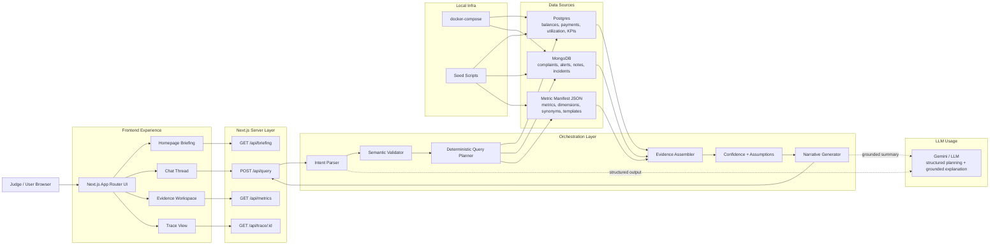

# QueryLens Architecture

## Summary

`QueryLens` will be a single `Next.js` application with an integrated server layer, backed by Dockerized `Postgres` and `MongoDB`. The LLM is used in a constrained role: it classifies intent, returns structured query plans, and writes grounded narratives over verified evidence.

## Architecture Principles

- The UI must show how an answer was produced.
- The system should prefer deterministic data access over open-ended text-to-SQL.
- The demo should feel technically real without introducing avoidable infrastructure complexity.
- The architecture must support a polished hackathon build and a clean story for judges.

## System Diagram

## Primary Components

### Frontend

- `Homepage Briefing`: default executive overview and example prompts
- `Chat Thread`: natural-language interaction and follow-up prompts
- `Evidence Workspace`: chart, drivers, definitions, assumptions, and source cards
- `Trace View`: optional technical transparency for how an answer was assembled

### Server Layer

- Route handlers live inside `Next.js`
- The server owns intent validation, query planning, evidence construction, and response formatting
- No separate API service is required in v1

### Data Layer

- `Postgres` stores canonical portfolio facts
- `MongoDB` stores contextual and semi-structured supporting signals
- A repo-managed manifest defines semantic rules and approved metrics

## Request Lifecycle

1. The user asks a natural-language question.
2. The system classifies the intent and extracts structured parameters.
3. The semantic layer validates supported metrics, dimensions, and date logic.
4. Deterministic planners query the required sources.
5. The evidence assembler builds supporting facts and provenance metadata.
6. The narrative layer produces a plain-English answer from verified evidence only.
7. The UI renders the answer alongside chart, evidence, assumptions, and follow-up prompts.

## Deployment Shape

### Local

- `Next.js` app runs locally
- `Postgres` and `MongoDB` run in Docker
- seed scripts create a reproducible demo state

### Hosted

- One deployed `Next.js` app
- Connected managed databases or equivalent hosted services
- Same semantic layer and seeded data story

## Default API Surface

- `POST /api/query`
- `GET /api/briefing`
- `GET /api/metrics`
- `GET /api/trace/:id`

## Design Consequences

- SQL should not be the centerpiece of the interface.
- Evidence must exist before the assistant writes an answer.
- The semantic layer is mandatory because it protects consistency and trust.
- Cross-source answers should explicitly say when they use corroboration from multiple systems.
