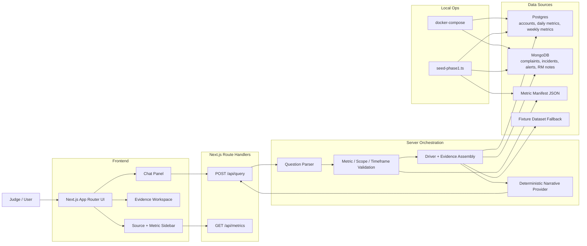

# QueryLens Architecture

## Current Architecture Summary

`QueryLens` is a single `Next.js` application with an integrated server layer. The current phase does not use a live LLM. Instead, it uses a deterministic provider interface over seeded `Postgres` facts, `MongoDB` context, and a repo-managed metric manifest.

## Current System Diagram

## Current API Surface

- `POST /api/query`
  - input: `{ question: string, scope?: { region?: string, sector?: string } }`
  - output: `Phase1AnalysisResponse`
- `GET /api/metrics`
  - returns the supported phase-1 metric definition and dimensions

Deferred endpoints such as briefing or trace APIs are not part of the current shipped slice and should not be documented as implemented.

## Current Request Lifecycle

1. The user submits a question through chat.
2. The server parses it into the phase-1 `what changed` shape.
3. The request is validated against the supported metric, scope, and timeframe rules.
4. The analysis layer reads weekly movement from `Postgres`.
5. The analysis layer reads corroborating context from `MongoDB`, or falls back to fixtures if live services are unavailable.
6. Drivers, evidence, confidence, assumptions, and chart data are assembled into a grounded response.
7. The UI renders the answer with visible trust evidence rather than raw SQL as the main user experience.

## Data Responsibilities

### Postgres

- Canonical structured facts
- Weekly comparison rows used to explain score movement
- Daily account metrics used to support believable seeded portfolio behavior

### MongoDB

- Contextual corroboration in the same time window
- Complaints, incidents, alerts, and RM notes

### Manifest

- Metric definition for `cashflow_health_score`
- Supported synonyms, dimensions, and allowed time windows

### Fixture Fallback

- Safe local fallback when database services are not configured or unavailable
- Must behave the same as the intended `database` answer shape

## Current Constraints

- No separate backend service
- No free-form SQL generation
- No live LLM calls in phase 1
- No upload-driven ingestion path in the main flow

## Immediate Next Gap

The current architecture is stable for the shipped phase-1 slice. The next gap is no longer infrastructure parity; it is product expansion on top of the proven path, most likely either:

- a narrow Gemini-backed provider with deterministic fallback
- or a second deterministic query slice such as `breakdown`
