# QueryLens Request Flow

This document explains what happens when a user asks a question in QueryLens today.

## High-Level Flow

```mermaid
flowchart LR
    U["User asks a question"] --> UI["Next.js workspace"]
    UI --> CHATID["Browser chatId + local thread state"]
    CHATID --> API["POST /api/query"]
    API --> RETRIEVE["RAG retrieval layer"]
    RETRIEVE --> PLAN["Gemini planner"]
    PLAN --> VALIDATE["Local validation"]
    VALIDATE --> ORCH["Analysis orchestrator"]
    ORCH --> EXEC["Intent executor"]
    EXEC --> DATA["Postgres / MongoDB / sample dataset"]
    DATA --> BUILD["Deterministic evidence, chart, and confidence assembly"]
    BUILD --> NARRATE["Gemini narrative wording"]
    NARRATE --> MEMORY["Conversation memory persistence"]
    MEMORY --> RESP["Structured response payload"]
    RESP --> UI2["Chat + evidence workspace update"]
```



## Step By Step

### 1. The browser sends the current turn

The chat UI keeps a persistent `chatId` in `localStorage` and sends:

```json
{
  "question": "What data is currently stored?",
  "chatId": "uuid",
  "scope": {
    "region": "optional",
    "sector": "optional"
  }
}
```

The browser also keeps the visible thread and the last active analysis locally so the conversation can survive a refresh.

### 2. The route validates the payload

`POST /api/query` accepts:

- `question`
- optional `chatId`
- optional explicit `scope`

Malformed payloads return `400`.

### 3. QueryLens retrieves context before planning

Before the model plans anything, QueryLens runs a lightweight retrieval step.

It retrieves:

- top metadata matches from `dataset_catalog_chunks`
- top prior memory matches from `conversation_memory_chunks`
- recent raw conversation turns from `conversation_messages`

This retrieval is for understanding the request, not for generating facts.

### 4. Gemini plans the request with retrieved context

Gemini receives:

- the current question
- retrieved dataset context
- retrieved conversation context
- strict function-calling schemas

It must emit one structured plan for a supported intent:

- `discovery`
- `what_changed`
- `breakdown`
- `compare`

Gemini never queries the database directly.

### 5. Local validation stays the trust boundary

The app validates the model plan against:

- the built-in SME dataset definition
- supported metrics
- allowed dimensions
- allowed time windows
- allowed compare shapes

If the plan is invalid, QueryLens returns an honest guided failure instead of guessing.

### 6. The orchestrator dispatches to the right executor

The generic orchestrator routes the validated plan to one executor:

- `discovery`
- `what_changed`
- `breakdown`
- `compare`

### 7. The executor reads grounded data

Depending on the intent, QueryLens reads from:

- `Postgres` for structured facts and `pgvector` retrieval tables
- `MongoDB` for complaints, incidents, alerts, and RM notes
- the built-in sample dataset when Docker-backed databases are unavailable

### 8. The answer is assembled deterministically

The model does not invent the analysis.

Application code computes:

- drivers or differences
- charts
- evidence
- assumptions
- confidence
- discovery catalog sections

For discovery questions, QueryLens combines retrieved metadata with deterministic source health and manifest data.

### 9. Gemini writes the final wording

Once the grounded response is assembled, Gemini can help write:

- `headline`
- `summary`
- supported follow-ups

If Gemini narrative output is invalid, QueryLens falls back to deterministic wording.

### 10. QueryLens stores memory for the next turn

After the answer is ready, QueryLens persists:

- the user turn
- the assistant turn
- a compact memory chunk with an embedding

That gives the next request conversational context without resending the entire thread.

### 11. The UI renders the updated conversation

The workspace updates:

- the chat thread
- the evidence panel
- the sidebar

For discovery questions, the center panel shows:

- dataset summary
- source overview
- catalog sections
- suggested next analytical questions

## Design Rules Behind The Flow

- Gemini interprets and words the answer, but does not become the source of truth.
- `pgvector` retrieval helps with context and vague questions, not fact fabrication.
- Local validation and deterministic executors keep the answer grounded.
- The UI always exposes evidence, assumptions, and source framing.
- Honest non-answers are better than unsupported guesses.

## Current Boundaries

Today this flow supports:

- `discovery`
- `what changed`
- `breakdown`
- `compare`

Still pending:

- `weekly briefing`
- dataset onboarding for user-provided tabular data
- richer trust/debug UX on top of the current retrieval trace
