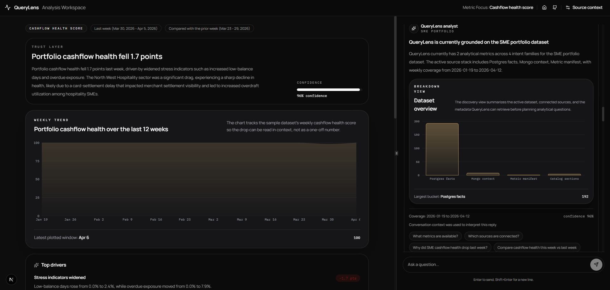

# QueryLens - Giga Devs

> **NatWest Group Hackathon — Talk to Data: Seamless Self-Service Intelligence - Giga Devs**

---

## Live Demo

> ### **[https://query-lens-one.vercel.app/](https://query-lens-one.vercel.app/)**
>
> **No setup required. Click the link and start asking questions immediately.**
> The live deployment runs against the database-backed SME portfolio dataset, with all four use cases available out of the box.

---



QueryLens is a **trust-first analytics interface** built for the NatWest Group hackathon challenge on seamless self-service intelligence. It lets non-technical users ask natural language questions about a synthetic SME banking portfolio and instantly receive clear, verified, source-backed answers — no SQL, no dashboards, no guesswork.

The product is built around the three pillars of the hackathon brief:

| Pillar      | How QueryLens delivers it                                                                                                                  |
| ----------- | ------------------------------------------------------------------------------------------------------------------------------------------ |
| **Clarity** | Plain-English narratives with jargon-free explanations for non-expert users                                                                |
| **Trust**   | Consistent metric definitions, visible evidence cards, assumptions, confidence scores, and source transparency across Postgres and MongoDB |
| **Speed**   | Near-instant responses through a structured query-plan model and a generic orchestrator — no complex multi-step workflows                  |

---

## Table of Contents

- [Live Demo](#-live-demo)
- [Overview](#overview)
- [Working Features](#working-features)
- [Tech Stack](#tech-stack)
- [Environment variables](#environment-variables)
- [Recommended Local Demo Path](#recommended-local-demo-path)
  - [1. Install dependencies](#1-install-dependencies)
  - [2. Create local environment config](#2-create-local-environment-config)
  - [3. Start the databases](#3-start-the-databases)
  - [4. Load the sample dataset](#4-load-the-sample-dataset)
  - [5. Start the app](#5-start-the-app)
  - [6. Run the flagship questions](#6-run-the-flagship-questions)
- [API Usage Examples](#api-usage-examples)
- [Validation Commands](#validation-commands)
- [Architecture Notes](#architecture-notes)
- [Repository Structure](#repository-structure)
- [Cleanup](#cleanup)

---

## Overview

QueryLens addresses the core problem in the hackathon brief: **many people struggle to get quick, accurate, and trustworthy answers from data** because of too many steps, unclear terminology, and lack of confidence in the results.

The current shipped milestone is intentionally focused on one strong local demo dataset rather than a broad but partial product. The app is designed for a short local demo where a reviewer can boot the stack, run a few sample-dataset questions, and understand both the product story and the supporting architecture quickly, works with both SQL and No SQL.

The four use cases from the hackathon spec are all represented:

- **Understand what changed** — `Why did SME cashflow health drop last week?`
- **Compare** — `Compare cashflow health this week vs last week`
- **Breakdown / decomposition** — `What makes up at-risk accounts by region and sector last week?`
- **Discover / summarise** — `What data is currently stored?`

---

## Working Features

- `QueryLens` three-pane interface with chat, evidence workspace, and source/metric sidebar
- `what changed` analysis for `cashflow_health_score`
- `breakdown` analysis for `at_risk_account_count`
- `compare` analysis for `cashflow_health_score`
- `discovery` answers for vague dataset questions such as available data, metrics, sources, and time coverage
- Stage 1 internal query-engine foundation:
  - built-in dataset abstraction for `sme_portfolio`
  - structured query-plan model
  - generic orchestrator and registered `discovery` / `what changed` / `breakdown` / `compare` executors
- Supported time windows: `this week` and `last week`
- Optional phase-1 scope filters for `region` and `sector`
- Cross-source evidence using the built-in sample portfolio facts and contextual signals
- Conversational memory with browser-persisted `chatId` and server-side conversation storage
- Simple RAG using `pgvector` in `Postgres` for dataset metadata retrieval and conversation-memory retrieval
- Visible trust artifacts: weekly trend, ranked drivers, evidence cards, assumptions, and confidence
- Dockerized local stack with reproducible sample data
- Automated coverage with `Vitest` and a Playwright browser smoke test

---

## Tech Stack

- `TypeScript`
- `Next.js` App Router
- `React`
- `Postgres`
- `MongoDB`
- `Docker Compose`
- `pgvector`
- `Vitest`
- `Playwright`
- `Bun`
- `Gemini API` via `@google/genai` for required interactive planning, embeddings, and narrative generation
- `Clerk` (`@clerk/nextjs`) for authentication and `clerkMiddleware` in `proxy.ts`
- `Convex` for user-scoped data (datasets, chats) and server calls from Next.js via `convex/nextjs`

---

## Environment variables

Use **`.env.example` as the template** and copy it to **`.env`** (gitignored) for local development. Next.js also reads **`.env.local`**; the Convex CLI often writes `NEXT_PUBLIC_CONVEX_URL` there when you run `npx convex dev`.

| Variable | Where it is used | Notes |
| -------- | ---------------- | ----- |
| `POSTGRES_URL` | Sample data seeding, `/api/query` facts | Default in `.env.example` matches local Docker. |
| `MONGODB_URL` | Sample data seeding, `/api/query` context | Default in `.env.example` matches local Docker. |
| `GEMINI_API_KEY` | Interactive query planning and narratives | Required for `/api/query`. |
| `QUERYLENS_GEMINI_MODEL` | Gemini model id | Optional; defaults to `gemini-2.5-flash`. |
| `NEXT_PUBLIC_CLERK_PUBLISHABLE_KEY` | Clerk browser SDK | From the [Clerk dashboard](https://dashboard.clerk.com). |
| `CLERK_SECRET_KEY` | Clerk server / `auth()` in API routes | From the Clerk dashboard; keep server-only. |
| `NEXT_PUBLIC_CONVEX_URL` | `ConvexReactClient` and `convex/nextjs` | From the [Convex dashboard](https://dashboard.convex.dev) or after `npx convex dev`. |
| `CLERK_JWT_ISSUER_DOMAIN` | `convex/auth.config.ts` | Set on the **Convex** deployment (e.g. `npx convex env set CLERK_JWT_ISSUER_DOMAIN "https://…clerk.accounts.dev"`). See [Convex + Clerk](https://docs.convex.dev/auth/clerk). |

Your personal **`.env`** is not committed; keep secrets there and treat **`.env.example`** as the documented checklist.

---

## Recommended Local Demo Path

This is the best way to run the product exactly as intended.

### 1. Install dependencies

```bash
npm install
```

### 2. Create local environment config

```bash
cp .env.example .env
```

Edit `.env` (and optionally `.env.local` for overrides):

- **Databases:** `.env.example` defaults match the local Docker stack (`POSTGRES_URL`, `MONGODB_URL`).
- **Gemini:** set `GEMINI_API_KEY` (required for `/api/query`). Optionally set `QUERYLENS_GEMINI_MODEL` if you do not want the default `gemini-2.5-flash`.
- **Clerk:** set `NEXT_PUBLIC_CLERK_PUBLISHABLE_KEY` and `CLERK_SECRET_KEY` from the Clerk dashboard so sign-in and server `auth()` work.
- **Convex:** set `NEXT_PUBLIC_CONVEX_URL` from your Convex project, or run `npx convex dev` in another terminal so the CLI can provision the project and sync env (often into `.env.local`).
- **Convex + Clerk JWT:** configure `CLERK_JWT_ISSUER_DOMAIN` on your Convex deployment so `convex/auth.config.ts` can validate Clerk-issued tokens (see the [Convex Clerk guide](https://docs.convex.dev/auth/clerk)).

### 3. Start the databases

```bash
npm run db:up
```

Wait until both `postgres` and `mongodb` are healthy.

### 4. Load the sample dataset

```bash
npm run seed
```

### 5. Start the app

```bash
npm run dev
```

For a **development Convex backend**, run `npx convex dev` in a separate terminal (keeps functions deployed and env in sync). Then open [http://localhost:3000](http://localhost:3000).

### 6. Run the flagship questions

Use the sample prompts or ask:

```text
What data is currently stored?
```

```text
Why did SME cashflow health drop last week?
```

```text
What makes up at-risk accounts by region and sector last week?
```

```text
Compare cashflow health this week vs last week
```

**Expected result:**

- a grounded narrative explaining the drop
- visible `Postgres` and `MongoDB` evidence
- top drivers highlighting stress in North West hospitality
- assumptions and confidence rendered in the center workspace
- a separate breakdown view showing where weekly at-risk accounts are concentrated
- a compare view showing the delta between two weekly windows or two peers
- a discovery view showing dataset coverage, sources, metrics, and suggested next questions

---

## API Usage Examples

### `GET /api/metrics`

```bash
curl http://localhost:3000/api/metrics
```

Returns the current metric manifest, including `cashflow_health_score` for `what changed` and `compare` questions, plus `at_risk_account_count` for the breakdown slice.

### `POST /api/query`

```bash
curl -X POST http://localhost:3000/api/query \
  -H "Content-Type: application/json" \
  -d '{"question":"What data is currently stored?","chatId":"demo-thread"}'
```

Example response shape:

```json
{
  "intent": "discovery",
  "headline": "QueryLens is currently grounded on the SME portfolio dataset",
  "summary": "QueryLens currently has 2 analytical metrics across 4 intent families for the SME portfolio dataset.",
  "metric": "dataset_catalog",
  "timeframe": "Coverage: 2026-01-12 to 2026-04-05",
  "comparisonBasis": "Catalog, source, and metadata overview",
  "confidence": 88,
  "catalogSections": [],
  "conversationContextUsed": false,
  "sourceMode": "database"
}
```

---

## Validation Commands

Run the automated checks with:

```bash
npm run lint
npm run test
npm run build
npm run test:e2e
```

---

## Architecture 

QueryLens is a single `Next.js` application with an integrated server layer and **Convex** for user-scoped persistence (for example datasets and chats), gated by **Clerk** identity on the client and in Convex.

- `POST /api/query` interprets the question, validates it against the current dataset and manifest, reads weekly facts from `Postgres`, reads corroborating context from `MongoDB`, and assembles a grounded narrative response.
- The server routes requests through a built-in dataset definition, a structured query-plan model, `pgvector` retrieval for metadata and conversation memory, and a generic analysis orchestrator before executing the current `discovery`, `what changed`, `breakdown`, or `compare` intent.
- `GET /api/metrics` exposes the current metric manifest for all shipped slices.
- Interactive query parsing requires Gemini planning for supported questions, while data retrieval, evidence assembly, charting, confidence, and retrieval persistence remain deterministic and grounded.
- Postgres and MongoDB are required for the workspace runtime; the sample-data loader seeds those databases for local demos.

For the fuller details and request lifecycle, see [Architecture.md](./Architecture.md) and [Flow.md](./Flow.md).


---

## Repository Structure

```text
.
├─ app/                  # Next.js routes and pages
├─ components/querylens/ # Active QueryLens UI
├─ data/                 # Metric manifest
├─ lib/querylens/        # Domain logic, analysis, scoring, sample dataset
├─ convex/               # Convex functions, schema, and Clerk JWT auth config
├─ scripts/              # Local sample-data load script
├─ tests/                # Unit, integration, and e2e tests
├─ docker-compose.yml
├─ .env.example
└─ README.md
```

---

## Cleanup

When you are done with the local stack:

```bash
npm run db:down
```
